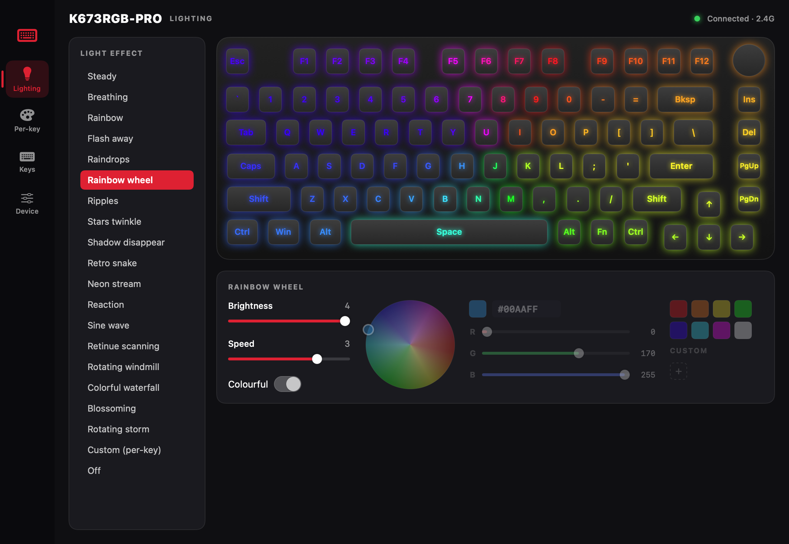
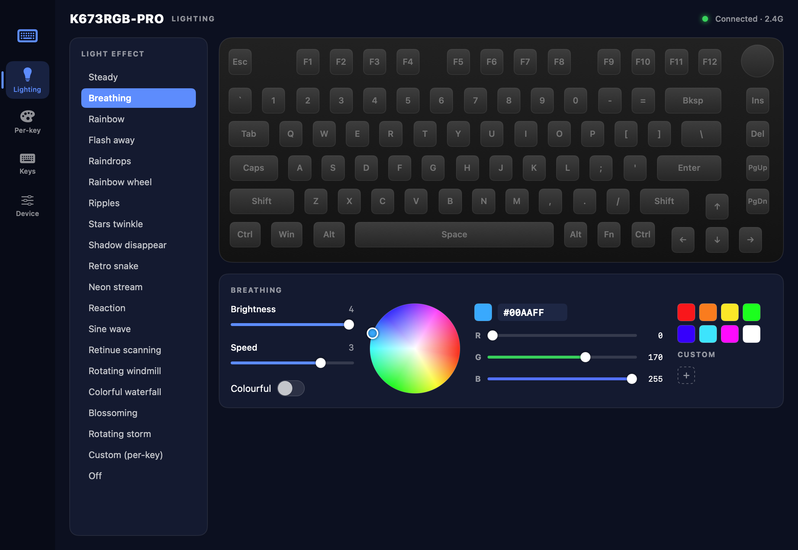
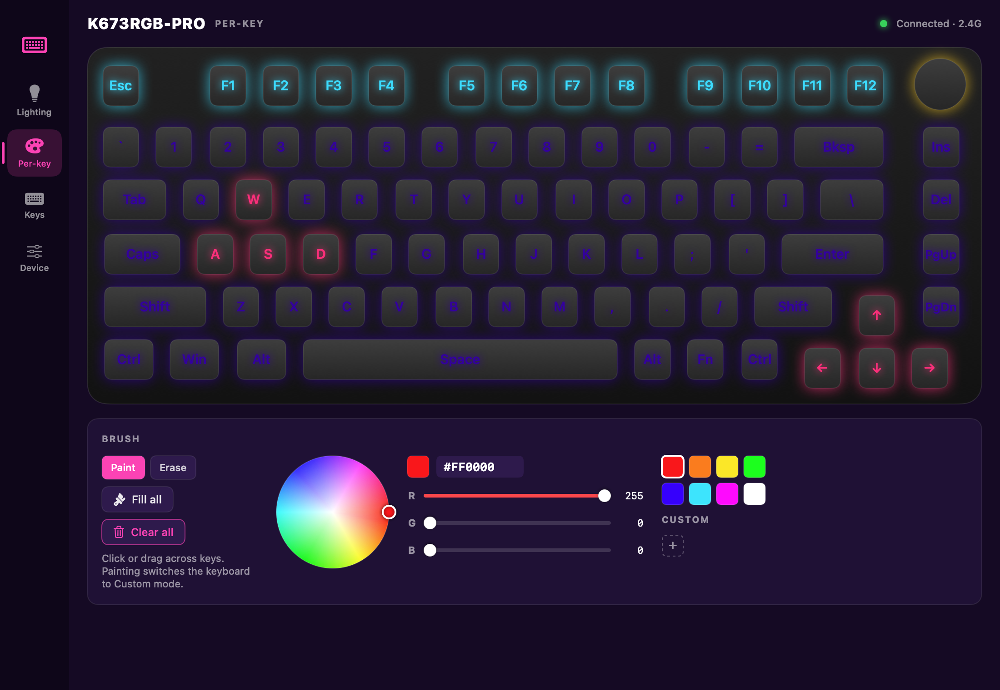
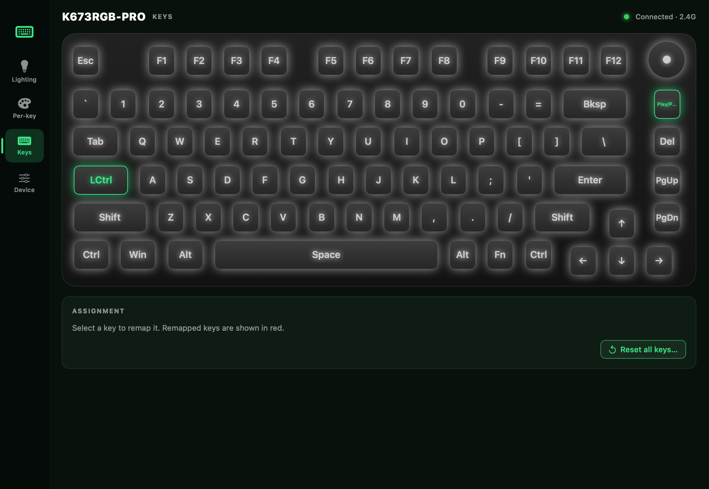
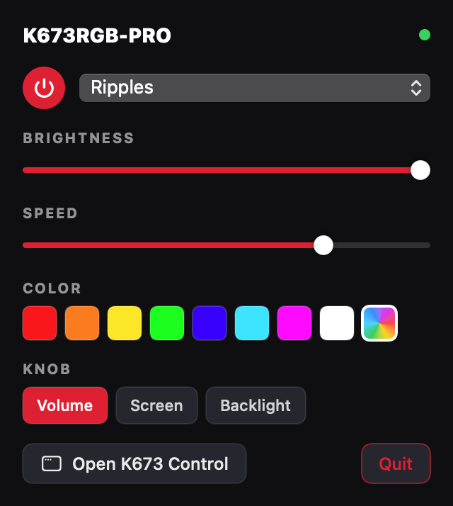
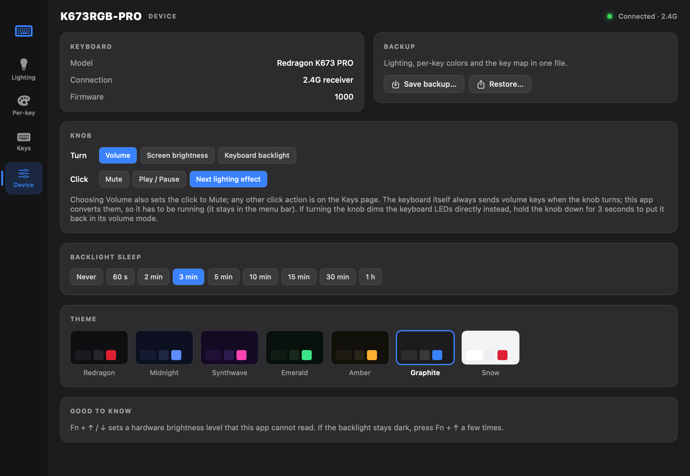
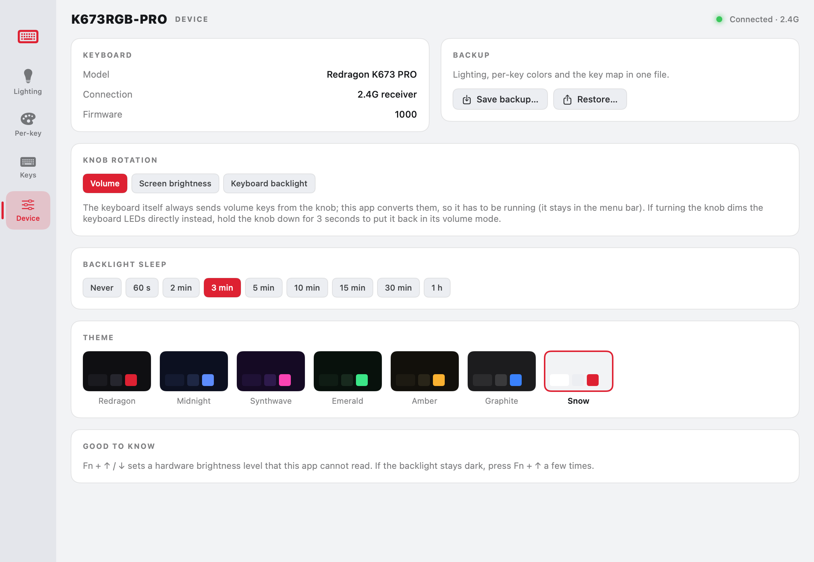

# K673 Control

A native macOS app (and CLI) for configuring the **Redragon K673 PRO** keyboard. Redragon only ships a Windows
configurator; this one talks to the keyboard directly over its 2.4G receiver, with a protocol reverse-engineered
from the vendor software and verified on real hardware.

> Unofficial project, not affiliated with or endorsed by Redragon. It writes settings to your keyboard — make a
> backup from the Device page first.

## Features

### Lighting
- All 18 built-in effects plus **Custom (per-key)** and **Off**, picked from a list like the vendor app.
- Per-effect **brightness** and **speed**, and a **Colourful** switch for effects that support multicolor.
- Full color picker: color wheel, hex field, R/G/B sliders, preset swatches and saved **custom colors**.
- **Live preview**: the on-screen keyboard simulates the selected effect (ripples, snake, windmill, raindrops, …).
  Reactive effects respond when you click keys in the preview.

### Per-key colors
- Click or **drag across keys** to paint, with Paint / Erase modes, Fill all and Clear all.
- The knob ring is paintable too. Painting switches the keyboard to Custom mode automatically.

### Key remapping
- Remap any base-layer key, and the knob click, to letters, digits, editing, function (F1–F20), navigation,
  modifiers, media keys or backlight up/down. Remapped keys are highlighted and show their new function.
- Reset a single key or the whole map. The Fn key is locked so the Fn layer can't be lost.

### Knob
Choose what turning the knob does: **Volume**, **Screen brightness** or **Keyboard backlight**.
The firmware hardwires the knob to volume keys, so the app converts them on the Mac (see [Knob](#knob)); it stays
in the menu bar to keep doing that with the window closed.

### Menu bar
A status-bar panel with a lighting power button, effect picker, brightness and speed, color presets and the knob mode.

### Device, backup and themes
- Backlight **sleep timer**, firmware info.
- **Backup / restore** of lighting, per-key colors and the key map to a JSON file.
- Seven UI **themes**: Redragon, Midnight, Synthwave, Emerald, Amber, Graphite and Snow (light).

### CLI
`k673ctl` does the same from a terminal or script:

    k673ctl status
    k673ctl effect breathing --color 00AAFF --speed 2
    k673ctl key-color FF0000 W A S D
    k673ctl remap CapsLock LCtrl
    k673ctl sleep 300
    k673ctl backup my-keyboard.json

## Install

Download the DMG from [Releases](../../releases), open it and drag **K673 Control** to Applications.
`k673ctl` is in the same DMG; copy it somewhere on your `PATH` if you want the CLI.

The build is ad-hoc signed, not notarized, so the first launch needs one of:

- right-click the app → **Open** → Open, or
- `xattr -dr com.apple.quarantine "/Applications/K673 Control.app"`

Permissions (System Settings → Privacy & Security):

- **Input Monitoring** — required. The receiver exposes its configuration interface on the same HID device as a
  keyboard, so macOS gates it.
- **Accessibility** — only for the Screen brightness / Keyboard backlight knob modes, to swallow the knob's volume keys.

Requires macOS 13 or later, the keyboard in **2.4G** mode with its receiver plugged in.

## Build

    ./build-app.sh                  # build/K673 Control.app and build/k673ctl
    UNIVERSAL=1 ./make-dmg.sh       # build/K673-Control-<version>.dmg (arm64 + x86_64)
    swift icon/make-icon.swift      # regenerate the icon (run inside icon/)
    .build/debug/K673App --screenshots docs/screenshots   # regenerate README images, no keyboard needed

Pushing a `v*` tag runs `.github/workflows/release.yml`, which builds the universal DMG on a macOS runner and
attaches it to a GitHub release. After a local rebuild the ad-hoc signature changes, so macOS asks for the
permissions again.

## Not covered

- Wired USB (`258a:010c`) and Bluetooth. Wired uses a different framing (519-byte feature reports) that is untested here.
- Fn-layer remapping, macros, report rate, debounce, and changing the knob inside the keyboard (see [Knob](#knob)).
- The Fn + ↑/↓ hardware brightness level: it is not part of the readable profile, and at zero it keeps the
  backlight dark regardless of what is written. If the LEDs stay dark, press Fn + ↑.
- The lighting preview is an approximation drawn from the effect names, not a capture of the firmware animations.

## Protocol

Firmware is BeiYing's (the Windows app is their `OemDrv.exe`, data dir `BYCOMBO4`). Layout below was taken from
that app's `KB.ini` and a WebHID configurator for other BeiYing boards, then confirmed on hardware.

Output/input report `0x13`, 19 payload bytes on usage page `0xFF02`:

| byte | meaning |
|------|---------|
| 0 | command |
| 1 | packet count (reply: bit 7 = NAK, resend the chunk) |
| 2 | packet index, bit 7 = key-matrix table (ignored over the dongle: both values hit the same map) |
| 3 | low nibble = data length (≤ 14), bits 4–5 = layer for key-matrix commands |
| 4–17 | data |
| 18 | `(0x13 + sum(bytes 0…16)) & 0xFF` |

Every written chunk is echoed as an ACK. Reads are one request answered by N packets; the link drops packets
now and then and there is no per-packet re-request, so a read with a gap is redone from the start.

| cmd | direction | payload |
|-----|-----------|---------|
| 7 | get | dongle status, data[0] ≠ 0 when the keyboard is linked |
| 5 | get | model code (data[5]) and firmware version (data[8…9]) |
| 68 / 4 | get / set | 128-byte profile |
| 73 / 9 | get / set | palettes, 20 effects × 7 slots × RGB (420 bytes) |
| 66 / 2 | get / set | per-key colors, planar R[126] G[126] B[126] |
| 65 / 1 | get / set | key matrix, 126 × `[type, param, codeHi, codeLo]` |
| 6 | set | factory reset (unused here) |

Profile: `[9]` 1 only for the custom effect, `[10]` effect id (1–18 in the vendor app's list order, 19 custom,
0 off; unknown ids turn the LEDs off), `[24]` backlight sleep in 30 s units, `[56 + 2·id]` brightness 0–4,
`[57 + 2·id]` speed 0–4 in the high nibble and color select in the low nibble (0 = palette slot 0, 7 = multicolor).

LED index = key-matrix slot = `column × 6 + row` (Esc 0, F1 12, knob click 90).

### Knob

Rotation is hardwired in firmware and no key-map slot changes it (tried 84/85, 102/108, with a power cycle).
Holding the knob 3 s toggles its mode: *volume* (rotation sends consumer `E9`/`EA`, click mutes) or *brightness*
(rotation changes the backlight internally and sends nothing to the host; click runs slot 90, factory = next effect).
The app's "Knob rotation" setting therefore works on the host: `KnobController` sees `E9`/`EA` arrive from the
dongle over IOHID, swallows the matching system volume event with an event tap (needs Accessibility), and posts a
brightness key or steps the profile brightness instead. It only works while the app runs and the knob is in volume
mode; Fn + F10/F11 on this keyboard are treated the same way.

Matrix types: `00` keyboard usage with `param` as modifier bitmask, `02` consumer usage, `0d` Fn, `07` lighting
controls, `08` firmware functions (`08 03 01 00` / `08 03 02 00` = backlight level up / down, what Fn + ↑/↓ send).

## License

MIT — see [LICENSE](LICENSE).
